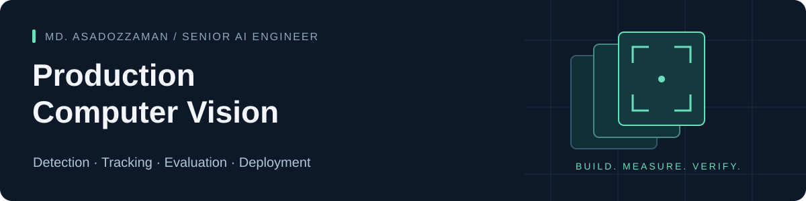

I build computer vision systems that connect **models, video pipelines, validation, and cloud infrastructure**. My work spans 5+ years of applied AI and backend engineering, with a focus on making model outputs useful in real applications.

**Senior AI Engineer at Tau Research · Based in Dhaka, working remotely**

[Explore the CVAT demo](https://asadozzaman.github.io/cvat-video-annotation-roundtrip/) · [LinkedIn](https://www.linkedin.com/in/md-asadozzaman/) · [Email](mailto:asadozzaman278061@gmail.com)

## Selected engineering work

### 01 / Video analytics — from frames to inspectable results

**[Production Video Analytics](https://github.com/asadozzaman/production-video-analytics)**

YOLO detection and ByteTrack tracking behind typed interfaces, with annotated MP4, frame-level JSON, track CSV, and a run summary that records configuration and stage timings. Output publication distinguishes completed runs from partial files.

- **Implemented:** detection, tracking, structured outputs, CPU execution, and focused unit tests.
- **Recorded baseline:** 393 frames processed; the Step 5 report records 14.89 frames/s end to end on CPU. This is a single functional run, not a hardware comparison or accuracy result.
- **Next milestone:** human-verified tracking evaluation, then line/zone counting and controlled CPU/GPU benchmarks.

[Read the run evidence](https://github.com/asadozzaman/production-video-analytics/blob/main/docs/phase1_baseline.md) · [Inspect the design](https://github.com/asadozzaman/production-video-analytics/blob/main/docs/architecture.md)

### 02 / Annotation integrity — verify the data before trusting the model

**[CVAT Video Annotation Round Trip](https://github.com/asadozzaman/cvat-video-annotation-roundtrip)**

A Python/API experiment that uploads a numbered video, writes a track, exports annotations, imports them into a clean task, and validates geometry and frame alignment.

- **Recorded result:** 35/35 checks passed against CVAT 2.76.0.
- **Evidence:** source and re-imported XML/API responses, validation JSON, and annotated frames.
- **Scope:** one synthetic video and one rectangle track; frame-image alignment checked at frames 5, 10, and 20. This validates the annotation round trip, not tracker accuracy.

[Open the visual walkthrough](https://asadozzaman.github.io/cvat-video-annotation-roundtrip/) · [Read the experiment](https://github.com/asadozzaman/cvat-video-annotation-roundtrip/blob/main/reports/CVAT_MINI_TEST_REPORT.md)

## More systems work

| Project | Engineering focus | Start here |
| --- | --- | --- |
| [Tree Counting](https://github.com/asadozzaman/Tree-counting-End-to-End) | Image upload, queued YOLO inference, job state, and downloadable results across Next.js, FastAPI, Redis, and PostgreSQL | [Architecture and local workflow](https://github.com/asadozzaman/Tree-counting-End-to-End#architecture) |
| [CLEAR-RAG](https://github.com/asadozzaman/Evaluating-Production-Grade-RAG-Systems) | Retrieval metrics, automated evaluation, human review, experiment comparison, and readiness gates | [Workflow and limitations](https://github.com/asadozzaman/Evaluating-Production-Grade-RAG-Systems#current-product-notes) |
| [Database Chat Assistant](https://github.com/asadozzaman/AI-Powered-Multi-Table-Database-Chat-Assistant) | Schema retrieval, foreign-key relationships, SQL validation, and an application around natural-language queries | [Implementation and screenshots](https://github.com/asadozzaman/AI-Powered-Multi-Table-Database-Chat-Assistant#screenshots) |

These repositories show different stages of implementation. Each project's documentation separates working behavior, recorded experiments, and remaining work.

## How I approach production AI

- **Validate the inputs and outputs.** Frame indexing, annotation geometry, and result schemas deserve the same scrutiny as model metrics.
- **Measure the whole pipeline.** Model inference speed and end-to-end processing speed answer different questions.
- **Make decisions inspectable.** Keep effective settings, experiment evidence, failure cases, and limitations close to the code.
- **Design clear boundaries.** Separate model inference, tracking, APIs, workers, and result storage so each can be tested and improved.

## Core tools

**Vision:** Python · PyTorch · YOLO · OpenCV · CVAT · ByteTrack

**Systems:** FastAPI · Django · PostgreSQL · Redis · Docker

**Cloud & AI:** AWS · SageMaker · RunPod · LLM/RAG evaluation

For computer vision pipelines, annotation tooling, evaluation, or production AI integration, [send me a message](mailto:asadozzaman278061@gmail.com) with the problem, sample inputs, and the outcome you need.
